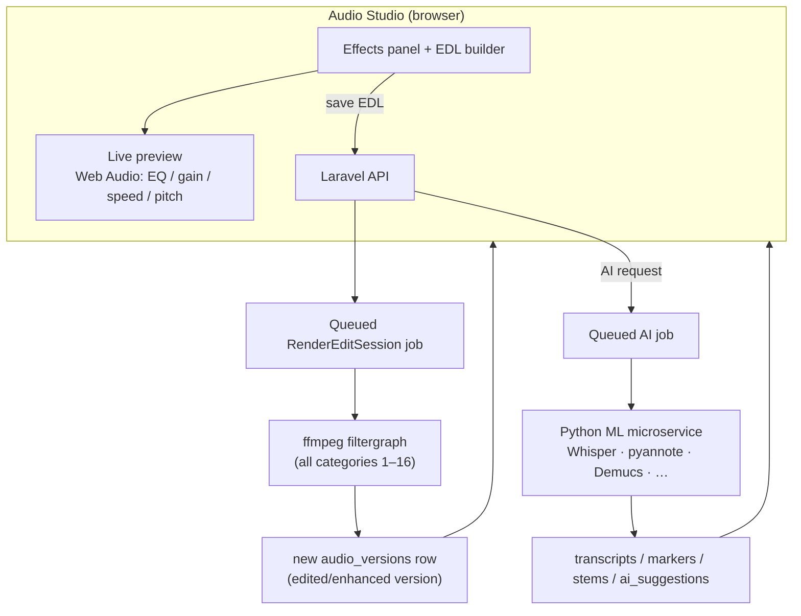

# Audio Editing & Enhancement — Design & Roadmap

Status: **proposal for review** (no code written yet). This document specifies how the
Audio Studio can grow from visualization + EDL-recording into a real editing and
enhancement suite covering the 20 audio-property categories, and the phased plan to build it.

---

## 1. Principles

1. **Non-destructive, always.** Every edit or enhancement produces a **new derived version**
   (`audio_versions`); the preservation master is never modified (FR-EDT-01/REP-03). This is
   already the model — we extend it, we don't change it.
2. **Record intent, then render.** The Studio records an ordered **operation list** (the EDL).
   A server job compiles that list into one deterministic **ffmpeg filtergraph** and renders
   the output. Re-running the same EDL always yields the same file.
3. **Preview in the browser, commit on the server.** Interactive effects (EQ, gain, speed,
   pitch, filters) are previewed live with the Web Audio API so the operator *hears* the
   result before committing; the authoritative render is server-side ffmpeg.
4. **Everything is a queued job.** Archival files are long; rendering and AI run in the
   background (existing queue worker) with progress surfaced in the Studio.

---

## 2. Architecture (three layers)



- **Layer 1 — Live preview (browser, Web Audio API).** A `GainNode` → `BiquadFilter` chain
  (EQ bands) → `DynamicsCompressorNode`, plus `playbackRate`/pitch on the media element.
  Zero server cost; lets operators audition before rendering. Not the final output.
- **Layer 2 — Render pipeline (server, ffmpeg).** The core new component. Compiles the EDL to
  an ffmpeg command, runs it on the source version in a queued job, writes a new derived
  version, reports progress/errors. Handles categories **1–16** (all non-AI editing).
- **Layer 3 — AI service (Python).** A separate FastAPI microservice (ideally GPU) for
  category **20**. Laravel dispatches jobs that call it over HTTP and store results. PHP
  cannot run these models; this is the one subsystem that lives outside Laravel.

---

## 3. Data model changes

Reuse what exists; add a little.

- **`edit_sessions`** (exists) — becomes the container for an edit. Extend `edl` (JSON) to the
  richer operation schema below. Add columns: `render_status` (draft|queued|rendering|done|failed),
  `progress` (0–100), `error`, `output_version_id` (exists).
- **`audio_versions`** (exists) — the render output. New `version_type` values:
  `edited`, `enhanced`, `restored`, `stem_vocals`, `stem_music`, `stem_other`. `derived_from_id`
  keeps the chain.
- **New `render_jobs`** (optional) — if we want a first-class job/audit record separate from
  the queue table (who rendered what, when, with which EDL, duration, ffmpeg command).
- **AI results reuse** existing `transcripts`, `audio_markers`, `ai_suggestions`; separated
  stems become `audio_versions` rows.

### EDL operation schema (proposed)

```jsonc
{
  "version": 1,
  "source_version_id": 42,
  "ops": [
    { "op": "trim",       "start": 5.0, "end": 60.0 },
    { "op": "cut",        "start": 12.3, "end": 14.1 },
    { "op": "fade",       "dir": "in",  "start": 0, "duration": 2 },
    { "op": "gain",       "db": 3 },
    { "op": "normalize",  "target_lufs": -16, "tp": -1.5 },
    { "op": "eq",         "bands": [{ "f": 100, "g": -4, "q": 1 }, { "f": 3000, "g": 3, "q": 1.2 }] },
    { "op": "denoise",    "strength": 0.6 },
    { "op": "dehum",      "freq": 50 },
    { "op": "declick" },
    { "op": "pitch",      "semitones": -2 },
    { "op": "tempo",      "factor": 1.1, "preserve_pitch": true },
    { "op": "silence_remove", "threshold_db": -40, "min_gap": 0.5 },
    { "op": "channels",   "layout": "stereo" },
    { "op": "resample",   "rate": 48000 },
    { "op": "export",     "format": "wav", "bit_depth": 24, "bitrate": null, "metadata": { "title": "…" } }
  ]
}
```

The render service maps `ops` (in order) to an ffmpeg `-af` filter chain + output flags.

---

## 4. ffmpeg operation catalog (categories 1–16)

Concrete mapping — this is what the `AudioRenderService` will generate.

| Category | Operation | ffmpeg |
|----------|-----------|--------|
| 1 Time | trim / cut / split | `atrim`+`asetpts`, `aselect`, segment demuxer |
| 1 | merge / concat | `concat` filter or concat demuxer |
| 1 | loop / reverse | `aloop`, `areverse` |
| 2 Amplitude | volume / mute-range | `volume`, `volume=enable='between(t,a,b)':volume=0` |
| 2 | normalize (EBU R128) | `loudnorm=I=-16:TP=-1.5:LRA=11` |
| 2 | compress / limit | `acompressor`, `alimiter` |
| 3 Frequency / EQ | parametric EQ | `equalizer=f=..:t=q:w=..:g=..` (per band) |
| 3 | bass / treble / de-hiss | `bass`, `treble`, `afftdn`/`anlmdn` |
| 4 Pitch | shift / keep-tempo | `rubberband=pitch=` |
| 5 Tempo | speed keep-pitch | `atempo=` (chain for >2×) or `rubberband=tempo=` |
| 6 Timbre | tone presets | `equalizer`+`aexciter` presets |
| 7 Sample rate | convert | `aresample=48000` / `-ar` |
| 8 Bit depth | convert | `-sample_fmt s16/s24/s32` / pcm codec |
| 9 Bitrate | encode | `-b:a 192k` (compressed exports) |
| 10 Channels | mono↔stereo / balance | `-ac`, `pan=stereo\|c0=..\|c1=..` |
| 11 Noise | hiss / broadband | `afftdn`, `arnndn=m=rnnoise.model`, `anlmdn` |
| 11 | hum (50/60 Hz) | `bandreject`/`anequalizer` at harmonics |
| 11 | click / pop / clip | `adeclick`, `adeclip` |
| 12 Silence | detect / remove | `silencedetect`, `silenceremove` |
| 13 Reverb (add) | room/hall | `aecho`, or `afir` convolution with impulse-response WAVs |
| 14 Echo (add) | echo | `aecho` |
| 15 Dynamic range | compress/expand/limit/normalize | `acompressor`, `compand`, `alimiter`, `dynaudnorm` |
| 16 Harmonics | exciter | `aexciter` |
| 17 Metadata | tags | `-metadata k=v` on export (+ DB fields) |

**Not native to ffmpeg (defer / ML):** reverb & echo *removal* (dereverberation), auto-tune,
voice cloning/conversion. Recommend excluding voice cloning entirely (ethics for a national
broadcaster); dereverb/auto-tune are later ML features if wanted.

---

## 5. AI microservice (category 20)

A standalone container (`betar_ai`) added to `docker-compose`, exposing a small HTTP API that
Laravel jobs call. Models run in Python; results are written back to the existing tables.

| Feature | Model / library | Output → |
|---------|-----------------|----------|
| Transcription (Bn/En) | `faster-whisper` | `transcripts` (timed lines) |
| Speaker diarization / ID | `pyannote.audio` | `transcripts` speaker labels + `audio_markers` |
| Language / dialect detect | Whisper LID | `ai_suggestions` |
| Emotion recognition | wav2vec2 / speechbrain | `audio_markers` (emotion) |
| Music genre / mood | musicnn / classifier | `ai_suggestions` (verify → `songs`) |
| Source separation | **Demucs** (speech vs music, or stems) | new `audio_versions` (`stem_*`) |
| Restoration / enhance | denoise + declip + VoiceFixer | new `audio_versions` (`restored`) |
| Content moderation | transcript keyword lists (Bn/En) + classifier | moderation queue / flags |

- All AI output stays **draft until human-verified** (FR-AIF-06) — already enforced by the
  `is_verified`/`status` fields on transcripts, markers and suggestions.
- Runs async: Laravel `dispatch(AiAnalyzeJob)` → POST to `betar_ai` → poll/callback → store.
- GPU strongly recommended for Whisper/Demucs speed; CPU works but is slow.

---

## 6. Phased roadmap

| Phase | Deliverable | Categories | Depends on |
|------|-------------|-----------|-----------|
| **P1 Foundation** | `AudioRenderService` + `RenderEditSession` queued job + progress UI; new derived-version output; ffmpeg-availability gating | plumbing | ffmpeg (Docker) |
| **P2 Core edits** | Effects panel: trim/cut/split/merge/reverse, volume/normalize/fade, EQ, pitch/tempo, silence-remove, channels/sample-rate/bit-depth/bitrate, metadata-on-export | 1–10, 12, 17 | P1 |
| **P3 Enhancement** | denoise, de-hum, de-click/pop, compressor/limiter, exciter, reverb-add; full loudness/QC report | 11, 13–16 | P1 |
| **P4 Live preview** | Web Audio effect chain (EQ/gain/speed/pitch) with A/B against original | 2–5 preview | P2 |
| **P5 AI service** | `betar_ai` container; transcription → diarization → source separation → moderation → restoration | 20 | new service |

Each phase is independently shippable. P1 is the unlock for everything in P2/P3.

---

## 7. Constraints & risks

- **ffmpeg required** for all rendering: present in the Docker image; a plain Windows
  `php artisan serve` needs ffmpeg installed or the render button is disabled with a clear
  message (same graceful pattern as ingestion in `AudioProcessor`).
- **Compute**: rendering long files is CPU-heavy → background jobs only; scale the queue
  worker. AI (Whisper/Demucs) ideally wants a GPU.
- **`arnndn`/RNNoise** and convolution reverb need small model/IR files shipped with the app.
- **Storage growth**: every edit/stem/restore is a new version file → plan retention/tiering
  (M22 already models storage tiers).
- **Quality expectations**: ffmpeg denoise/declick are good, not magical; ML restoration
  (VoiceFixer/Demucs) is markedly better for badly degraded tape — that's why P5 matters for
  true archival restoration.
- **Scope**: full delivery is multi-week. Recommend P1+P2 first (covers the FRS "most
  valuable" editing list), then P3, then P5.

---

## 8. What we reuse (already built)

`edit_sessions` (EDL), `audio_versions` (version family + immutable master), `AudioProcessor`
(ffmpeg wrapper + WAV fallback + loudness/peak/silence), the Studio waveform/spectrogram/meters,
`audio_markers`, `transcripts`, `ai_suggestions`, the database queue + worker, and ffmpeg in the
Docker image. The net-new work is the **render service/job**, the **effects UI**, the **live
preview chain**, and the **AI microservice**.
