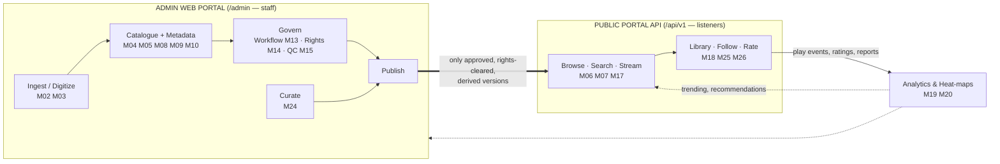
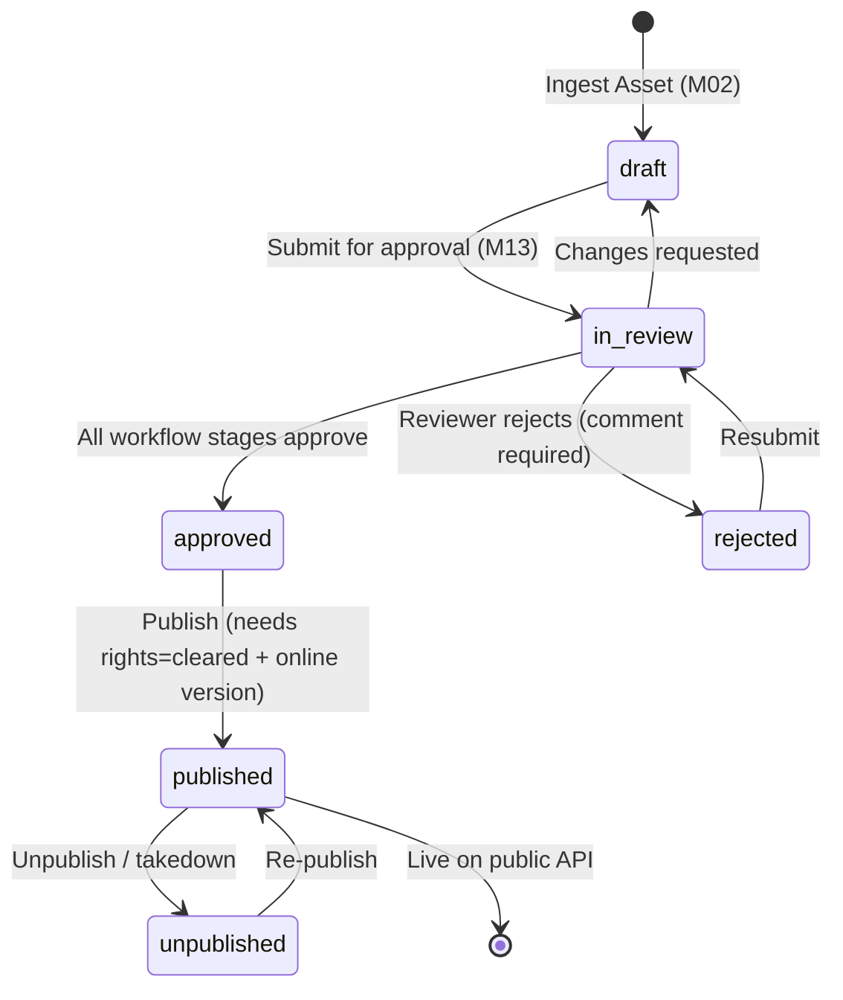

# Platform Walkthrough — Modules, Sidebar Items & Data Flow

This is the "how it all fits together" guide. For **every sidebar item** it tells you:
what it is, which FRS module and database table back it, who uses it, how to **view** the
data, how to **create/post** it, how it gets **published**, and where it **appears in the
public portal** (which API endpoint a listener app calls).

- Admin Portal: `/admin` · Public API: `/api/v1`
- Companion docs: [`USER_MANUAL.md`](USER_MANUAL.md) (task steps), [`DEVELOPMENT.md`](DEVELOPMENT.md) (code map), [`API_DOCUMENTATION.md`](API_DOCUMENTATION.md) (endpoints).

---

## 1. How to read each entry

Every sidebar item below uses the same mini-template:

- **Module** — FRS module code (M01–M27).
- **What it does** — one line.
- **Data** — the table(s) it reads/writes and the key fields.
- **Roles** — who has the menu item (permission that unlocks it).
- **View** — where/how to see the data in the portal.
- **Post** — how to create/enter data.
- **Publish** — how it becomes public (or "internal only" if it never leaves the portal).
- **Public surface** — the `/api/v1` endpoint where a listener app sees it (or "—").

> **Sidebar is permission-filtered.** You only see items your role can access. A Moderator
> sees *Community*; a Music Library Manager sees *Catalogue*; a Super Administrator sees all.

---

## 2. The big picture — two apps, one pipeline



**The single gateway** between the two apps is *Publish*. Nothing is reachable from
`/api/v1` until an item is published, and only **derived** streaming versions are ever
served — never the preservation master (FR-PLY-10).

---

## 3. The golden path — an asset's life

Almost everything in the archive is (or is attached to) an **AudioAsset**. Its `status`
column is a state machine:



**Gates enforced in code** (`AudioAssetController@publish`):
1. `rights_status` must be `cleared` (M14) — else publication is blocked (FR-CPR-05).
2. `status` must be `approved` (or `unpublished`) — only fully approved items publish (FR-WRK-07).
3. An `online` derived version must exist — masters are never streamed.

Once published, the asset appears in `AudioAsset::published()` (status=`published` +
access_level=`public` + rights=`cleared`), which every public catalogue query filters on.

**Two layers of "published".** The *asset* passes the workflow gate above. Catalogue
*entities* (album, artist, programme, podcast channel) additionally carry a simple
`is_published` toggle on their own form — set it so the entity's page and its listing show
up publicly. A song is public when its underlying asset is published; an album/artist page
is public when its `is_published` flag is on **and** it has published tracks.

---

## 4. Application request flow (what happens on every click)

```
Browser → route (web.php) → middleware chain → Controller → Model (Eloquent) → Blade view
                              │
                              ├─ auth        (must be logged in)
                              ├─ staff       (must be an active staff account)
                              └─ permission:<x>  (role must hold permission x)
```

- **Admin** requests run `auth → staff → permission:<name>`. Fail permission → **403**.
- **Public API** requests run either `optional.auth` (guest-friendly; attaches the user if a
  token is sent) or `auth:sanctum` (token required), plus a 120 req/min rate limit.
- Every create/update/delete on an auditable model writes a row to **`audit_logs`** (M21).

---

## 5. Sidebar walkthrough

### Top level

#### 🏠 Dashboard
- **Module** M20 · **Route** `/admin`
- **What** Role-aware landing page: totals, storage, listeners, plus your role's widgets
  (approval queue, QC failures, rights expiring, moderation queue, revenue…), a 14-day
  listening chart, content-mix doughnut, Most Played, and recent uploads.
- **Data** aggregates across `audio_assets`, `asset_stats_dailies`, `approvals`, `payments`,
  `subscriptions`, `comments`, `rights_records`, `media_items`.
- **Roles** everyone (`dashboard.view`).
- **View** it's the home screen. **Post/Publish** — none (read-only). **Public surface** —.

#### ✅ My Approvals
- **Module** M13 · **Route** `/admin/approvals`
- **What** Your personal queue of items waiting on a stage your role owns, with ageing
  indicators; open one to approve / reject / request changes.
- **Data** `approvals` + `approval_actions` (+ the polymorphic `approvable`, usually an asset).
- **Roles** anyone with `approvals.view`; acting needs `approvals.act` (reviewers, Copyright
  Officer, Approver).
- **View** list → *Review* opens the detail with the full action history and stage progress.
- **Post** you don't create approvals here — they arrive when a submitter clicks
  *Submit for approval* on an asset. **Publish** — approving the final stage sets the asset
  to `approved`, unlocking *Publish*. **Public surface** —.

---

### Archive — bringing audio in and organising it

#### 📼 Audio Assets — *the heart of the system*
- **Module** M02 / M04 · **Route** `/admin/assets`
- **What** Every piece of audio: song, programme, podcast, story, news, drama, speech, PSA,
  advert… Each gets a permanent **archive ID** (`BB-YYYY-NNNNNN`) and a **version family**
  (immutable preservation master + online + preview).
- **Data** `audio_assets` (title/title_bn, content_type, station/programme/category/language,
  technical metadata, `status`, `access_level`, `rights_status`, `is_premium`,
  `is_public_service`, `waveform_peaks`…) + `audio_versions` (per-version files) +
  `audio_asset_tag`, `audio_asset_artist`.
- **Roles** Archive Admin, Archivist, and content managers (`assets.view`; upload/edit/
  publish are separate permissions).
- **View** Filterable list (type, status, station, rights) → click a row for the **detail
  page**: interactive waveform "player", version family, rights, QC report, transcripts, AI
  suggestions, listening heat-map, and the full approval history.
- **Post** *Ingest Asset* → fill Bangla/English metadata, hierarchy, dates, access flags.
  Saving mints the archive ID and registers the master. *(In this build the file bytes are
  represented by version metadata; the real transcode/waveform pipeline is a documented
  queued-job extension.)*
- **Publish** On the asset page: *Submit for approval* → (workflow) → *Publish*.
- **Public surface** `GET /api/v1/assets/{id}`, `…/stream`, and it shows up inside `home`,
  `trending`, `search`, etc. once published.

#### 💿 Digitization
- **Module** M03 · **Route** `/admin/media-items`
- **What** Register physical media (reel, cassette, DAT, vinyl, CD) and track it through
  *registered → in progress → captured → restored → QC → archived*; link the finished digital
  asset back to its source.
- **Data** `media_items` (item_code, media_type, condition, priority, status, restoration
  notes, `audio_asset_id` link).
- **Roles** Archive Admin, Archivist (`digitization.view/manage`).
- **View** list with a progress strip (counts per stage). **Post** *Register Item*.
- **Publish** — internal; the *linked* asset follows the normal asset path. **Public surface** —.

#### 📻 Stations
- **Module** M04 · **Route** `/admin/stations`
- **What** The regional Bangladesh Betar stations — the top of the hierarchy
  Station → Department → Programme → Season → Episode.
- **Data** `stations` (+ `departments`).
- **Roles** Archive Admin, Super Admin (`stations.view/manage`).
- **View** cards with department/programme/asset counts. **Post** *New Station*.
- **Publish** — internal metadata. **Public surface** appears only as the `station` label on
  public asset/programme objects.

#### 🗂️ Programmes
- **Module** M04 · **Route** `/admin/programmes`
- **What** Programme/collection records (drama, news, event, magazine, talk show) that group
  episodes and assets.
- **Data** `programmes` (+ `seasons`, `episodes`). `is_published` toggle.
- **Roles** Programme Producer, Archive Admin (`programmes.view/manage`).
- **View** table with episode/asset counts. **Post** *New Programme*.
- **Publish** set **Published** on the form. **Public surface**
  `GET /api/v1/programmes` and `…/programmes/{id}` (with its episodes).

#### ✂️ Edit Sessions
- **Module** M12 · **Route** `/admin/edit-sessions`
- **What** Non-destructive editing sessions (trim/fade/normalize/clips) recorded as an Edit
  Decision List over a **working proxy** — the master is never touched.
- **Data** `edit_sessions` (edl JSON, source/output version, status).
- **Roles** Audio Editor (`editing.view/use`).
- **View** read-only list of sessions + operation counts. **Post** created by the editing tool
  (the browser waveform editor is the M12 extension point). **Publish** finished edits enter
  the approval workflow as new versions. **Public surface** — (only the resulting published
  clip/version).

---

### Catalogue — the music library

#### 🎵 Songs
- **Module** M08 · **Route** `/admin/songs`
- **What** Song records layered on a song-type asset: genre, mood, album, track number,
  version type (original/live/remastered/instrumental/cover), lyrics (Bangla/English) and
  singer/composer/lyricist credits; version families group covers under one master.
- **Data** `songs` + `artist_song` (credits) + the linked `audio_assets`.
- **Roles** Music Library Manager (`songs.view/manage`).
- **View** filterable table (genre, album) → the asset detail page for playback/waveform.
- **Post** *New Song* → pick the audio asset, classify it, add credits & lyrics.
- **Publish** the song is public once its **underlying asset is published** (workflow → publish).
- **Public surface** `GET /api/v1/songs`, `…/songs/{id}` (with lyrics + waveform),
  and inside search/trending/album pages.

#### 💿 Albums
- **Module** M08 · **Route** `/admin/albums`
- **What** First-class browsable albums (artwork, year, ordered track list).
- **Data** `albums` + `album_artist`; tracks are `songs.album_id`. `is_published` + `is_featured`.
- **Roles** Music Library Manager. **View** artwork grid. **Post** *New Album* (then assign
  songs to it from the song form).
- **Publish** set **Published**. **Public surface** `GET /api/v1/albums`, `…/albums/{id}`
  (ordered playable tracks); featured albums can fill a home row.

#### 🧑‍🎤 Artists
- **Module** M08 · **Route** `/admin/artists`
- **What** Reusable person records (singer, composer, presenter, voice artist, narrator…),
  with bios and a *featured* flag; public artist pages listeners can follow.
- **Data** `artists`; links via `artist_song`, `album_artist`, `audio_asset_artist`;
  `followers_count`, `is_published`, `is_featured`.
- **Roles** Music Library Manager, Archive Admin (`artists.view/manage`).
- **View** table with song/follower counts. **Post** *New Artist*.
- **Publish** set **Published**. **Public surface** `GET /api/v1/artists`, `…/artists/{id}`
  (bio + songs + albums), `…/featured-artists`; followable via `POST /api/v1/me/follows/toggle`.

#### 🔀 Playlists (editorial / curated collections)
- **Module** M08 / M24 · **Route** `/admin/playlists`
- **What** Staff-built curated collections (e.g. "Songs of 1971") publishable to the app.
  (Listener-made playlists live only via the API.)
- **Data** `playlists` (`is_editorial=true`) + `playlist_items` (polymorphic).
- **Roles** Content Curator, Music Library Manager (`playlists.view/manage`).
- **View** table. **Post** *New Collection* → add songs/assets, order them.
- **Publish** set **Published**. **Public surface** `GET /api/v1/editorial-playlists` and via
  a `curated_playlists` home section.

#### 🔧 Vocabularies
- **Module** M05 · **Route** `/admin/vocabularies/{categories|genres|moods|languages|tags}`
- **What** Controlled vocabularies you manage without code — categories, genres, moods,
  languages, tags. FR-MET-03.
- **Data** `categories`, `genres`, `moods`, `languages`, `tags`.
- **Roles** anyone with `taxonomies.view`; edit needs `taxonomies.manage`.
- **View** tabbed inline-editable tables. **Post** the "Add" panel on each tab.
- **Publish** — these are building blocks. **Public surface** `GET /api/v1/categories`,
  `…/genres`; the rest appear as labels on content objects.

---

### Content — podcasts & event stories

#### 🎙️ Podcast Channels
- **Module** M09 · **Route** `/admin/podcast-channels`
- **What** Channels that hold seasons/episodes, with cover art and an external RSS feed.
- **Data** `podcast_channels` (`rss_enabled`, `is_published`, `followers_count`).
- **Roles** Podcast Manager (`podcasts.view/manage`).
- **View** table with episode/follower counts. **Post** *New Channel*.
- **Publish** set **Published**. **Public surface** `GET /api/v1/podcasts`, `…/podcasts/{id}`
  (+ episodes); RSS at `/podcasts/{slug}/rss.xml` (free episodes only).

#### ▶️ Podcast Episodes
- **Module** M09 · **Route** `/admin/podcast-episodes`
- **What** Episodes with season/episode numbers, chapters, premium flag and **scheduled**
  publication.
- **Data** `podcast_episodes` (`status` draft/scheduled/published, `scheduled_at`, chapters JSON).
- **Roles** Podcast Manager. **View** table. **Post** *New Episode* (link a podcast-type asset).
- **Publish** set status to *published* now, or *scheduled* for a future date/time.
- **Public surface** `GET /api/v1/podcast-episodes/{id}`, and inside a channel's episode list.

#### 👻 Event Episodes (Bhoot FM-style)
- **Module** M10 · **Route** `/admin/episodes`
- **What** Episodes of story-based programmes; one episode contains several independent stories.
- **Data** `episodes` (programme_id, number, broadcast_date, `is_published`).
- **Roles** Programme Producer (`episodes.view/manage`).
- **View** table with story counts. **Post** *New Episode*.
- **Publish** set **Published**. **Public surface** `GET /api/v1/episodes/{id}` (with its stories).

#### 💬 Stories
- **Module** M10 · **Route** `/admin/stories`
- **What** Individually addressable stories inside an episode — start/end timestamps,
  storyteller (with an **anonymous** option), district, category, content warning.
- **Data** `stories` (`is_anonymous`, `start_seconds`/`end_seconds`, `content_warning`).
- **Roles** Programme Producer (`stories.view/manage`).
- **View** table. **Post** *New Story* (attach to an episode, set timestamps).
- **Publish** set **Published**. **Public surface** `GET /api/v1/stories/{id}` — the
  storyteller shows as "Anonymous" when the flag is set (FR-EVT-04).

#### 📥 Story Submissions
- **Module** M10 · **Route** `/admin/story-submissions`
- **What** Listener-submitted stories (text/audio) with a **consent record**; review and
  accept/reject.
- **Data** `story_submissions` (consent_given, consent_at, status).
- **Roles** Moderator (`submissions.view/review`).
- **View** queue with inline review. **Post** created by listeners; accepted ones become new
  stories/assets. **Public surface** submitted via `POST /api/v1/feedback` / future submission
  endpoint; the queue itself is internal.

---

### Marketing — voice & advertisement production (M11)

#### 🎙️ Voice Artists · 📄 Scripts · 📣 Campaigns
- **Module** M11 · **Routes** `/admin/voice-artists`, `/admin/scripts`, `/admin/marketing-campaigns`
- **What** The production side for marketing spots: searchable **voice-artist** profiles
  (language/accent/tone), **scripts** with version control, and **campaigns** with client
  approval, recording takes/channel variants, and usage-rights periods with expiry alerts.
- **Data** `voice_artists`, `scripts` (version chain), `marketing_campaigns` + `campaign_assets`.
- **Roles** Marketing User (`marketing.view/manage`).
- **View** tables; campaigns highlight **usage rights expiring within 30 days** (FR-MKT-06).
- **Post** create voices, scripts, then a campaign; attach takes.
- **Publish** the finished master goes through approval like any asset; **serving** to
  listeners is handled by *Ad Assets/Campaigns* (M27), not here. **Public surface** — (the
  produced spot surfaces only as an ad via M27).

---

### Governance — the quality & rights gate

#### 🔀 Workflows
- **Module** M13 · **Route** `/admin/workflows`
- **What** Configurable multi-stage approval chains **per content type** (song, podcast,
  advert, historical, default). Each stage names the role that can act.
- **Data** `workflows` + `workflow_stages`.
- **Roles** Super Admin, Approver (`workflows.view/manage`).
- **View** table of workflows + stage counts. **Post** *New Workflow* → add ordered stages
  (name + approver role) via the repeater. **Publish** — governs everyone else's publishing.
- **Public surface** —.

#### ⚖️ Rights Records · 👥 Rights Holders
- **Module** M14 · **Routes** `/admin/rights-records`, `/admin/rights-holders`
- **What** Copyright/broadcast/streaming rights per asset — holder, rights types, territory,
  validity dates, royalties. Saving a record **syncs the asset's `rights_status`**, which
  gates publication; the list flags rights **expiring soon** (90/30/7 days).
- **Data** `rights_records`, `rights_holders`.
- **Roles** Copyright Officer (`rights.view/manage`).
- **View** records list (filter by status / expiring), holders directory. **Post** *New Record*
  (pick asset + holder + rights types + dates). **Publish** — clearing rights *enables*
  publishing an asset; expiry can auto-block it. **Public surface** — (rights are enforced,
  never exposed).

#### 🛡️ Quality Control
- **Module** M15 · **Route** `/admin/qc-reports`
- **What** Automated technical checks (silence, clipping, volume, noise, channel faults,
  loudness) per file; a reviewer sees the evidence + waveform and gives a verdict.
- **Data** `qc_reports` (checks JSON, overall_result, verdict).
- **Roles** Archive Admin (`qc.view/review`).
- **View** list (pass/warning/fail stat cards) → report detail with the checks table + waveform.
- **Post/Publish** submit a **verdict** (approve/reject/reprocess); approving a `pending_qc`
  asset moves it to `in_review`. **Public surface** —.

#### 📄 Transcripts · ✨ AI Review
- **Module** M16 · **Routes** `/admin/transcripts`, `/admin/ai-suggestions`
- **What** AI-generated timed transcripts/lyrics and metadata suggestions (summary, tags,
  genre, mood, language, speaker). **All AI output is a draft until a human verifies it**
  (FR-AIF-06). Verified transcripts feed spoken-word search.
- **Data** `transcripts`, `ai_suggestions`.
- **Roles** Archivist (`transcripts.view/manage`, `ai-suggestions.view/review`).
- **View** lists with AI/verified badges. **Post/Publish** *Verify* a transcript or
  *Accept/Reject* a suggestion. **Public surface** verified transcripts/lyrics appear on the
  public song/asset detail and power `GET /api/v1/search/semantic`.

---

### Community — engagement & moderation (M26)

#### 💬 Comments
- **Route** `/admin/comments` · **What** Moderate listener comments (approve/hide/remove);
  moderation mode (pre/post) and the Bangla/English profanity filter are set in Settings.
- **Data** `comments`. **Roles** Moderator (`moderation.view/manage`).
- **View** queue (pending first). **Post** listeners create them via
  `POST /api/v1/assets/{id}/comments`. **Public surface** approved comments show at
  `GET /api/v1/assets/{id}/comments`.

#### 🚩 Reported Content · ❗ Issue Reports · 🛡️ Takedowns · 📥 Feedback
- **Route** `/admin/content-reports`, `/admin/issue-reports`, `/admin/takedown-requests`,
  `/admin/feedback`
- **What** The safeguards queue: user reports of abusive comments (M26), reports of
  broken audio / wrong metadata (FR-ENG-07), external rights-holder **takedown** complaints
  (FR-ENG-08 — can temporarily unpublish the asset), and general feedback (FR-ENG-09).
- **Data** `content_reports`, `issue_reports`, `takedown_requests`, `feedback`.
- **Roles** Moderator, plus Copyright Officer for takedowns (`issues.*`, `takedowns.*`,
  `feedback.*`).
- **View** queues with resolve/status forms. **Post** all created from the public app
  (`POST /api/v1/reports`, `/issue-reports`, `/feedback`). **Publish** actioning a takedown
  with "unpublish" flips the linked asset to `unpublished`. **Public surface** — (inputs only).

---

### Curation — shaping the public home screen (M24)

#### 🧩 Home Sections
- **Route** `/admin/home-sections` · **What** Create, order, schedule and enable the rows on
  the public home screen — dynamic (Trending, New Releases, On This Day, Featured Artists,
  Top Played, curated playlists) or manually curated ("custom"); seasonal sections can be
  scheduled to appear/disappear (FR-CUR-03).
- **Data** `home_sections` (+ `home_section_items` for manual ones).
- **Roles** Content Curator (`curation.view/manage`).
- **View** ordered list. **Post** *New Section* (type, layout, position, schedule).
- **Publish** set **Active** (and within its schedule window). **Public surface** assembled
  live by `GET /api/v1/home`.

#### 🏳️ Banners
- **Route** `/admin/banners` · **What** Promotional banners with scheduling and a link target.
- **Data** `banners`. **Roles** Content Curator. **View** list. **Post** *New Banner*.
- **Publish** set **Active**. **Public surface** the `banners` array of `GET /api/v1/home`.

---

### Business — freemium, payments & advertising (M18, M27)

#### ⭐ Plans · ⭐ Promo Codes
- **Route** `/admin/plans`, `/admin/promo-codes` · **What** Configure the **Free** and
  **Premium** plans (pricing, trial length, feature flags: ads, quality cap, offline,
  equalizer, preview length) and discount codes.
- **Data** `plans` (features JSON), `promo_codes`. **Roles** Super Admin/Approver
  (`plans.view/manage`).
- **View** plan comparison cards / code table. **Post** edit plan features; *New Promo Code*.
- **Publish** active immediately. **Public surface** `GET /api/v1/plans`; codes apply at
  `POST /api/v1/me/subscription/subscribe`.

#### 💳 Subscriptions · 🏦 Payments
- **Route** `/admin/subscriptions`, `/admin/payments` · **What** View subscriber status and
  cancel; view transactions and issue **full/partial refunds** (reason required, audit-logged,
  FR-SUB-13).
- **Data** `subscriptions`, `payments`. **Roles** Approver (`subscriptions.*`, `payments.*`).
- **View** filterable tables + revenue stat cards. **Post** listeners subscribe via the API;
  staff cancel/refund here. **Public surface** the listener side is
  `GET/POST /api/v1/me/subscription*` and `GET /api/v1/me/payments`.

#### 📣 Ad Campaigns · ▶️ Ad Assets · 👥 Advertisers
- **Module** M27 · **Routes** `/admin/ad-campaigns`, `/admin/ad-assets`, `/admin/advertisers`
- **What** The ad library and serving rules for the **free tier**: advertisers, campaigns
  (flight dates, budget, targeting, frequency cap), and ad assets (commercial spots + house
  announcements + PSAs used as fallback). Premium and public-service content never get ads.
- **Data** `advertisers`, `ad_campaigns`, `ad_assets`, `ad_impressions`.
- **Roles** Advertisement Manager (`ads.view/manage/reports`).
- **View** tables + delivery counts. **Post** create advertiser → campaign → assets.
- **Publish** ad assets go through approval (M13) then become *active*/*servable*.
- **Public surface** served **inside** `GET /api/v1/assets/{id}/stream` (the `ad` field) to
  free listeners; impressions logged via `POST /api/v1/ads/impression`.

---

### Insights — measurement & protection (M19–M22)

#### 📊 Analytics
- **Route** `/admin/analytics` · **What** Plays, unique listeners, completion/skip/replay
  rates, per-asset **second-by-second heat-maps** (most-replayed sections), platform &
  regional breakdowns, trending. Feeds the public trending/recommendation rows.
- **Data** `play_events` (raw) → `asset_stats_dailies` (aggregates + heatmap JSON).
- **Roles** Approver, managers (`analytics.view`). **View** dashboard + per-asset drill-down.
- **Post** rows arrive from `POST /api/v1/assets/{id}/events`. **Public surface**
  drives `GET /api/v1/trending`, `…/top-played`, `…/recommendations/for-you`.

#### 🕒 Audit Trail
- **Route** `/admin/audit-logs` · **Module** M21 · **What** Immutable, append-only log of
  every significant action (who/what/when/before-after). Searchable & filterable.
- **Data** `audit_logs`. **Roles** Super Admin, Copyright Officer, Archive Admin (`audit.view`).
- **View** filter by user/action/date. **Post** written automatically by the `Auditable`
  trait — you never create these by hand. **Public surface** —.

#### 🖥️ Backups
- **Route** `/admin/backups` · **Module** M22 · **What** Status of scheduled backups (three-copy
  rule) and file **integrity/fixity checks**; corrupt copies are flagged.
- **Data** `backup_runs`, `integrity_checks`. **Roles** Archive Admin (`backups.view`).
- **View** run history + fixity results + stat cards. **Post/Publish** — read-only monitoring.
- **Public surface** —.

---

### System (M01 + configuration)

#### 👥 Users
- **Route** `/admin/users` · **What** Create/edit/deactivate staff and listener accounts and
  assign a role. **Data** `users` (+ Spatie `model_has_roles`). **Roles** Super Admin
  (`users.*`). **View** filterable list. **Post** *New User* (all seeded users' password is
  `123456`). **Publish** — n/a. **Public surface** listeners self-register via
  `POST /api/v1/auth/register`.

#### 🛡️ Roles & Permissions
- **Route** `/admin/roles` · **What** Define roles and tick the exact permissions each
  grants — this is what filters every sidebar and blocks every unauthorized action.
- **Data** Spatie `roles`, `permissions`, pivots. **Roles** Super Admin (`roles.*`).
- **View** role cards. **Post** *New Role* → check permission groups. **Public surface** —.

#### ⚙️ Settings
- **Route** `/admin/settings` · **What** Central configuration: **General**, **Theme**
  (primary/accent colours + mode — changing these re-skins the whole portal instantly),
  **Streaming** (quality caps, preview length, signed-URL TTL, skips), **Moderation**,
  **Rights** (expiry alert days), **Workflow** (escalation), **Ads** (frequency cap),
  **Backup** (schedule). **Data** `settings` (key/value/type) + `config/theme.php`.
- **Roles** Super Admin (`settings.view/manage`). **View/Post** grouped form; theme colours use
  a colour picker. **Public surface** streaming/plan settings shape what the API returns
  (quality, preview length, ad frequency).

---

## 6. Worked example A — publish a new song end-to-end

1. **Vocabularies** → make sure the genre/mood/language exist (Music Library Manager).
2. **Artists** → create the singer/composer/lyricist if new; set **Published**.
3. **Audio Assets → Ingest Asset** → content type *song*, Bangla + English titles, category
   *Songs*, station, first-broadcast date. Save → archive ID `BB-2026-000xxx` + master registered.
4. **Songs → New Song** → pick that asset, set genre/mood/album/track, add credits + lyrics,
   tick *mood/genre verified*.
5. **Rights Records → New Record** → holder + rights types (broadcast, streaming) + validity →
   status **cleared** (this sets the asset's `rights_status`).
6. **Quality Control** → the QC report should be *pass*; submit an *approved* verdict if needed.
7. On the **asset detail page** → *Submit for approval* → it enters the **Song Publication
   Workflow** (Technical QC → Music Library Review → Copyright Review → Management Approval).
8. Each reviewer (via **My Approvals**) approves in turn. After the last stage the asset is
   **approved**.
9. Back on the asset page → **Publish**. Gates checked: rights cleared ✔, approved ✔, online
   version exists ✔ → `status=published`.
10. Every step is written to the **Audit Trail**.

**Result:** the song now returns from `GET /api/v1/songs`, `…/songs/{id}`, appears in
`search`, and can be streamed via `…/assets/{id}/stream`.

## 7. Worked example B — how a listener sees & plays it (public API)

```
GET  /api/v1/home                      → curated rows + banners (guest or member)
GET  /api/v1/search?q=modhumoti        → finds the song
GET  /api/v1/songs/42                   → detail incl. lyrics + waveform
GET  /api/v1/assets/108/stream          → signed URL (+ pre-roll ad if free tier)
POST /api/v1/assets/108/events          → {event_type:"play"} → play_count++ & analytics
POST /api/v1/me/favorites/toggle        → save it (needs login)
POST /api/v1/assets/108/rate {rating:5} → rate it → updates avg on the admin side
```

A **free** listener gets a preview for premium-flagged content + an ad; a **premium**
listener (after `POST /api/v1/me/subscription/subscribe`) gets the full-length, ad-free,
high-quality stream. Those play events flow back into **Analytics**, which powers the
**trending** and **recommendation** rows — closing the loop.

---

## 8. Data-store reference (FRS Appendix A → tables)

| Store | Purpose | Tables |
|-------|---------|--------|
| D1 Audio Repository | masters, versions, waveforms | `audio_assets`, `audio_versions` |
| D2 Metadata DB | catalogue, hierarchy, people | `programmes`, `seasons`, `episodes`, `stories`, `songs`, `albums`, `artists`, `podcast_*`, taxonomy tables |
| D3 User & Role DB | accounts, RBAC, library | `users`, Spatie tables, `playlists`, `favorites`, `follows`, `saved_searches` |
| D4 Rights DB | licences & complaints | `rights_holders`, `rights_records`, `takedown_requests` |
| D5 Analytics DB | events, aggregates, heat-maps | `play_events`, `asset_stats_dailies` |
| D6 Subscription DB | plans, entitlements | `plans`, `subscriptions`, `promo_codes` |
| D7 Audit Log | immutable action log | `audit_logs` |
| D9 Transcript Store | transcripts, lyrics | `transcripts` |
| D10 Workflow/Ingest | workflow instances | `workflows`, `workflow_stages`, `approvals`, `approval_actions` |
| D11 Digitization | physical items | `media_items` |
| D16 QC Reports | analysis + verdicts | `qc_reports` |
| D17 Payment Transactions | charges & refunds | `payments` |
| D19 Curation Store | sections, banners | `home_sections`, `home_section_items`, `banners` |
| D21 UGC & Moderation | comments, reports, feedback | `comments`, `ratings`, `content_reports`, `issue_reports`, `feedback` |
| D22 Ad Inventory & Log | ads & impressions | `advertisers`, `ad_campaigns`, `ad_assets`, `ad_impressions` |

## 9. Admin action → public API map (quick reference)

| Admin does… | Public listener sees it at… |
|-------------|------------------------------|
| Publish an asset/song | `GET /api/v1/songs`, `/assets/{id}`, `/search`, `/trending` |
| Publish album / mark featured | `GET /api/v1/albums`, `/albums/{id}` |
| Publish artist / mark featured | `GET /api/v1/artists`, `/featured-artists` |
| Publish programme + episode | `GET /api/v1/programmes/{id}`, `/episodes/{id}` |
| Publish podcast channel/episode | `GET /api/v1/podcasts`, `/podcast-episodes/{id}` |
| Publish story (episode) | `GET /api/v1/stories/{id}` |
| Publish editorial collection | `GET /api/v1/editorial-playlists` |
| Enable & schedule home section | `GET /api/v1/home` (sections) |
| Activate banner | `GET /api/v1/home` (banners) |
| Verify transcript/lyrics | song/asset detail + `/search/semantic` |
| Activate ad campaign/asset | `ad` field inside `/assets/{id}/stream` (free tier) |
| Configure plans | `GET /api/v1/plans`, subscribe flow |
| (Automatic) analytics aggregation | `/trending`, `/top-played`, `/recommendations/for-you` |
```
